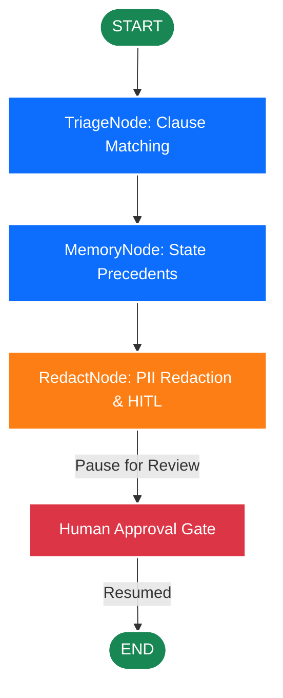

# Architectural Specification & Verification Document
## Document Compliance & Privacy Analyzer

This document provides a comprehensive overview of the design principles, graph architecture, codebase walkthrough, Model Context Protocol (MCP) integrations, and validation testing for the **Document Compliance & Privacy Analyzer** application.

---

## 1. Executive Summary & Design Goals
The Document Compliance & Privacy Analyzer is a production-grade multi-agent auditing application designed to scan legal agreements (such as NDAs, consulting contracts, and service agreements) for two critical dimensions:
1. **Compliance Policy Audit**: Identifying conflicting clauses that introduce legal exposure (e.g., overlapping jurisdictions, joint IP claims, or capped liability vs unlimited indemnity).
2. **Data Privacy Audit**: Detecting and redacting Sensitive Personal Data (PII) including email addresses, phone numbers, and cloud API credentials.

The system uses a graph-based multi-agent execution pipeline built on the **Google Agent Development Kit (ADK 2.0)**, Python, and a responsive **Streamlit** frontend with real-time graph visualization and Human-in-the-Loop (HITL) gates.

---

## 2. Multi-Agent Graph Architecture & Workflow Topology

The core application execution is designed as a directed workflow graph consisting of three specialized, decoupled agentic nodes.



### Node Descriptions & State Management

Each node modifies or references a central Pydantic session state definition (`ComplianceState`) which is persistent and synchronized automatically by the ADK 2.0 Runner:

```python
class ComplianceState(BaseModel):
    document_name: str = ""
    raw_text: str = ""
    triaged_clauses: List[Dict[str, Any]] = Field(default_factory=list)
    memory_matches: List[Dict[str, Any]] = Field(default_factory=list)
    redacted_text: str = ""
    compliance_status: str = "Pending"
    interrupted_node: Optional[str] = None
    hitl_decision: Optional[Dict[str, Any]] = None
```

1. **`TriageNode`**:
   - Parses the document payload (supporting raw strings or files loaded from the local workspace).
   - Audits the text line-by-line using regexes specified in `config.py`.
   - Populates `ctx.state["triaged_clauses"]` and transitions status to `"Triaged"`.
2. **`MemoryNode`**:
   - Queries a persistent, simulated long-term database `compliance_registry.json`.
   - Automatically cross-references flagged clauses to see if similar conflicts have pre-approved legal overrides or historical resolution precedents.
   - Populates `ctx.state["memory_matches"]` and transitions status to `"Checked"`.
3. **`RedactNode`**:
   - Performs regex-based search-and-replace rules for Emails, Phone Numbers, and API Keys.
   - Yields a `RequestInput(interrupt_id, message, payload)` event to pause the graph.
   - On resume (via `ctx.resume_inputs`), it evaluates the reviewer's verdict. If approved, it writes the clean redacted file back to the workspace and marks the transaction as `"Approved"`; otherwise, it flags it as `"Rejected"`.

---

## 3. Codebase Component Walkthrough

### 📂 File Structure
```
capstone_vibecoding/
│
├── compliance_analyzer/
│   ├── __init__.py           # Package interfaces
│   ├── agents.py             # ADK 2.0 graph workflow definition & nodes
│   ├── config.py             # Compliance matching & regex definitions
│   ├── tools.py              # SecureStreamReader traversal validation tool
│   └── mcp_server.py         # FastMCP Server exposing secure tools
│
├── app.py                    # Streamlit visual dashboard
├── mcp_config.json           # Model Context Protocol profile registration
├── NonDisclosureAgreement.txt # Sample NDA file
├── ConsultingAgreement.txt   # Sample consulting agreement
├── run.bat                   # CMD startup batch file
└── run.ps1                   # PowerShell startup script
```

### 3.1. Policy Definition: `config.py`
Defines the rules for flagging contradictions and PII patterns:
- **Governing Law**: Resolves multiple conflicting state boundaries (e.g. New York, California, Delaware, Florida, Texas).
- **IP Ownership**: Identifies joint ownership content contradictions.
- **Limitation of Liability**: Scans for capped liability thresholds alongside unlimited indemnification liabilities.
- **PII Patterns**: Includes standard-compliant regexes for emails, telephone numbers, and cloud access keys.

### 3.2. Secure Tooling: `tools.py`
Contains the `SecureStreamReader` class:
- Resolves paths securely in the local context directory.
- Verifies that all operations remain bounded inside the active workspace folder, throwing a `PermissionError` if directory traversal attempts are detected.

### 3.3. Node Logic: `agents.py`
Integrates ADK `@node` decorators. Unpacks inputs of type `types.Content` dynamically, ensuring full compatibility with client runtimes. Implements graph compilation using the `Workflow` class.

### 3.4. Stdio MCP Server: `mcp_server.py`
Hosts a FastMCP instance exposing three main stdio tools:
1. `read_document_stream(filename)`
2. `write_document_stream(filename, content)`
3. `list_workspace_documents()`

### 3.5. Streamlit Front-End: `app.py`
Creates a premium web application dashboard:
- Embedded custom Google Font (`Outfit`) and modern container styling.
- Responsive graphical stepper showing real-time workflow statuses (`START` ➔ `TriageNode` ➔ `MemoryNode` ➔ `RedactNode` ➔ `END`).
- Human-in-the-loop review dashboard presenting flagged conflicts, historical precedent overrides, and an editable redaction viewport.

---

## 4. Test Execution & Parity Verification

Validation scripts were developed and executed to verify core capabilities and the MCP server.

### 4.1. Core Multi-Agent Graph Testing (`validate_analyzer.py`)
Executes the workflow graph end-to-end against `NonDisclosureAgreement.txt` and `ConsultingAgreement.txt`.

**NonDisclosureAgreement.txt Results**:
- **TriageNode**: Detected Governing Law Contradiction (High), Limitation of Liability Inconsistency (Medium), Intellectual Property Ownership Dispute (High).
- **MemoryNode**: Found 2 historical resolutions in the precedent database.
- **RedactNode**: Redacted 4 Emails and 2 Phone Numbers.
- **HITL Integration**: Paused, accepted human response, wrote clean `NonDisclosureAgreement_redacted.txt` file (2351 bytes).

**ConsultingAgreement.txt Results**:
- **TriageNode**: Flagged Governing Law, Liability Cap, and IP Assignment conflicts.
- **MemoryNode**: Located 0 precedent overrides (correctly identifying a new contract).
- **RedactNode**: Redacted 4 Emails and 1 Phone Number.
- **HITL Integration**: Paused, accepted human response, wrote clean `ConsultingAgreement_redacted.txt` file (2392 bytes).

### 4.2. Model Context Protocol Testing (`test_mcp.py`)
Tested stdio tools programmatically:
- **`list_workspace_documents`**: Discovered and listed workspace files successfully.
- **`read_document_stream`**: Read the NDA document securely without path traversal errors.
- **`write_document_stream`**: Created a temporary stream file, verified contents, and cleaned it up without error.

---

## 5. GitHub Repository Deployment & Execution Guide

Follow these steps to deploy and run the application directly from the GitHub repository:

### 5.1. Clone the Codebase
Clone the remote repository locally:
```bash
git clone https://github.com/purusothaman-raghu/kaggle-capstone.git
cd kaggle-capstone
```

### 5.2. Configure a Virtual Environment
Set up a clean virtual environment to manage dependencies:

**On Windows:**
```powershell
python -m venv .venv
.\.venv\Scripts\activate
```

**On macOS/Linux:**
```bash
python3 -m venv .venv
source .venv/bin/activate
```

### 5.3. Install Dependencies
Install all required libraries locked in `requirements.txt`:
```bash
pip install -r requirements.txt
```

### 5.4. Launch the Server
Start the frontend Streamlit server:

**Using Startup Scripts (Windows CMD / PowerShell):**
```cmd
run.bat
# or
.\run.ps1
```

**Manual CLI Execution (Any Platform):**
```bash
python -m streamlit run app.py
```

Once running, navigate your web browser to:
🌐 [http://localhost:8501](http://localhost:8501)
